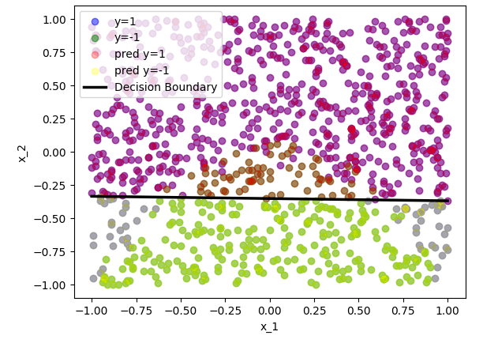

# Week2 Assignment Report

### Dataset id: 6-6-6  

## (a)

<div>
<center>

<br>
Visualised data graph
</center> 
</div>


(i) Using numpy to load the data set from the txt file, then visualize it by matplotlib. The markers indicating each class are shown on the bottom left. The graph is also similar to the graph in the instruction document. 

(ii) The decision boundary calculated by a logistic model can be written as:

$$
θ_0+θ_1x_1+θ_2x_2=0
$$
And we can get the coefficient set and the intercept: [0.08619205 5.06610909] and [1.78829503], indicating:
$$
θ_0 = 1.78829503, θ_1 = 0.08619205, θ_2 = 5.06610909
$$
Thus, the boundary can be written as:
$$
0.08619205x_1+5.06610909x_2+1.788295031=0
$$
Then we can rewrite the equation to:
$$
x_2=\frac{1.78829503+0.08619205x_1}{-5.06610909}
$$

We can also tell from the parameter values we obtained above, the θ1 is a very small number close to zero which means it will make feature x1 have less impact on predictions. So feature x2 has most influence on the prediction.

(iii) Then according to the equation above, we can get the decision boundary. As the following graph, the black line in the center is the decision boundary.


<div>
<center>

<br>
Decision Boundary
</center> 
</div>


(iv) The decision boundary is linear but the dataset is non-linear, therefore, it is reasonable that the predictions failed to match the labels. According to the distribution of the points, the boundary should be quadratic so it might be underfitting. Thus instead of changing hyperparameters, it might be more efficient changing quadratic model. 


## (b)

(i) First we need to set a list of candidate values of 'C' : 0.001, 0.01, 1, 10, 100, 1000. Then we can use LinearSVC function in sklearn to train to obtain the new parameter values:
$$
When~C=0.001,θ_0=0.24587642, θ_1=0.023121, θ_2=0.45683574
$$

$$
When~C=0.01,θ_0=0.41712681, θ_1=0.02030266, θ_2=1.17380565
$$

$$
When~C=1,θ_0=0.64770945, θ_1=0.01637619, θ_2=1.8494905
$$

$$
When~C=10,θ_0=0.65346945, θ_1=0.01657394, θ_2=1.86614893
$$

$$
When~C=100,θ_0=0.65407461, θ_1=0.01661755, θ_2=1.86789476
$$

$$
When~C=1000,θ_0=0.65413465, θ_1=0.0166215, θ_2=1.86806845
$$

(ii) For better comparison we also need to control the hyperparameters, therefore, all hyperparameters except 'C' are remaining the same during the experiment. And then we generate a plot with several subplots to visualize the results, in addition, different 'C' will be evaluated by the 'score' function which calculated the mean accuracy measured with the given dataset to get the accuracies.  


<div>
<center>

<br>
Different 'C' values with their accuracies
</center> 
</div>


(iii) From the questions(i)&(ii) we can know that the value of C will affect the decision boundary. According to the graph we got from question (ii) above shows the accuracy trend regarding the change of 'C'. 'C' stands for the regularization strength. A small C would allow the model to accept a smaller margin, if the margin can separate most of the points. On the other hand, a larger C would force the model to maximize the margin and may harm the classification performance. The SVM model can also reach the best performance with a medium value of C, which also helps the model to avoid overfitting or underfitting.

(iv) The shape of the boundaries are similar. The value of C brings large differences to the model's accuracy on the same dataset. However, this hyperparameter has little effect on the logistic regression model.


## (c)

(i) After adding the additional features, the new model will be: 
$$
θ_0+θ_1x_1+θ_2x_2+θ_3x_1^2+θ_4x_2^2=0
$$
Then we can use the the same hyperparameters from the questions before to obtain the new parameter values:
$$
θ_0=0.38311111, θ_1=0.03970063, θ_2=6.65826619, θ_3=6.65556341, θ_4=-1.09207904
$$


<div>
<center>

<br>
Visualised data graph with new features
</center> 
</div>


(ii)&(iii) Then we can get the new graph as shown above. The results predicted by the model are different from the former models. It is apparent that the shape of the decision boundaries vary, but it is difficult to calculate the boundary of a quadratic model.  In addition, we can get the accuracy by 'score' function and the accuracy of this model is 0.96096, much higher than the linear model trained with the same hyperparameters. 


## Appendix

```python
import numpy as np
import matplotlib.pyplot as plt
from sklearn.linear_model import LogisticRegression
from sklearn import svm
# id: 6-6-6    

#(a) (i)
# load the dataset
file = open('week2.txt', 'r') 
data = np.array([line.strip().split(',') for line in file.readlines()]).astype(float)
# Separate the Xs and ys, and create two index lists
x = data[:, :2]
y = data[:, 2]
index1 = [i for i in range(len(y)) if y[i] == 1]
index2 = [i for i in range(len(y)) if y[i] == -1]
# Visualize the data
plt.figure()
plt.scatter(x[index1, 0], x[index1, 1], color='blue', label='y=1')
plt.scatter(x[index2, 0], x[index2, 1], color='green', label='y=-1')
plt.legend()
plt.xlabel('x_1')
plt.ylabel('x_2')
plt.show()

#(a) (ii)
clf = LogisticRegression(solver='saga').fit(x, y)
pred = clf.predict(x)
pred_index1 = [i for i in range(len(y)) if pred[i] == 1]
pred_index2 = [i for i in range(len(y)) if pred[i] == -1]

# Get the coefficient and intercept 
coef = clf.coef_[0]
intercept = clf.intercept_

print(coef)
print(intercept)

#(a) (iii)
# Obtain the decision boundary
x1 = np.linspace(-1, 1, 10)
x2 = (-intercept-x1*coef[0])/coef[1]

# Visualize the result
plt.figure()
plt.scatter(x[index1, 0], x[index1, 1], color='blue', label='y=1', alpha=0.5)
plt.scatter(x[index2, 0], x[index2, 1], color='green', label='y=-1', alpha=0.5)

plt.scatter(x[pred_index1, 0], x[pred_index1, 1], color='red', label='pred y=1', alpha=0.3)
plt.scatter(x[pred_index2, 0], x[pred_index2, 1], color='yellow', label='pred y=-1', alpha=0.3)

plt.plot(x1, x2, label='Decision Boundary', color='black', linewidth=2.5)
plt.legend()
plt.xlabel('x_1')
plt.ylabel('x_2')
plt.show()

#(b) (i)&(ii)
penalties = [0.001, 0.01, 1, 10, 100, 1000]
accuracies = []
plt.figure(figsize=[20, 20])
for index in np.arange(len(penalties))+1:
    plt.subplot(3, 3, index)
    
    # Model construction
    clf = svm.LinearSVC(C=penalties[index-1],dual=False).fit(x, y)
    
    # Predict the values and calculate the accuracy
    acc = clf.score(x, y)
    accuracies.append(acc)
    pred = clf.predict(x)
    pred_index1 = [i for i in range(len(y)) if pred[i] == 1]
    pred_index2 = [i for i in range(len(y)) if pred[i] == -1]

    # Get the coefficient and intercept to obtain the decision boundary
    coef = clf.coef_[0]
    intercept = clf.intercept_
    print(coef)
    print(intercept)
    
    # Obtain the decision boundary
    x1 = np.linspace(-1, 1, 10)
    x2 = (-intercept-x1*coef[0])/coef[1]
    
    plt.scatter(x[index1, 0], x[index1, 1], color='blue', label='y=1', alpha=0.5)
    plt.scatter(x[index2, 0], x[index2, 1], color='green', label='y=-1', alpha=0.5)

    plt.scatter(x[pred_index1, 0], x[pred_index1, 1], color='red', label='pred y=1', alpha=0.3)
    plt.scatter(x[pred_index2, 0], x[pred_index2, 1], color='yellow', label='pred y=-1', alpha=0.3)

    plt.plot(x1, x2, label='Decision Boundary', color='black', linewidth=2.5)
    plt.title('LinearSVC with C=%.3f (Accuracy=%.3f)'%(penalties[index-1], acc))
    plt.legend()
    plt.xlabel('x_1')
    plt.ylabel('x_2')
    
plt.tight_layout()
plt.show()

#(c) (i)
# Add additional features
x_quad = np.concatenate(([x[:, 0]], [x[:, 1]], [x[:, 0]**2], [x[:, 1]**2])).T
# Fit the model
clf = LogisticRegression(solver='saga').fit(x_quad, y)
score = clf.score(x_quad, y)
# Get the new coefficient and intercept
coef = clf.coef_[0]
intercept = clf.intercept_

print(intercept)
print(coef)
print(score)

#(c) (ii)
pred = clf.predict(x_quad)
pred_index1 = [i for i in range(len(y)) if pred[i] == 1]
pred_index2 = [i for i in range(len(y)) if pred[i] == -1]
# Visualize the result
plt.figure()
plt.scatter(x[index1, 0], x[index1, 1], color='blue', label='y=1', alpha=0.5)
plt.scatter(x[index2, 0], x[index2, 1], color='green', label='y=-1', alpha=0.5)

plt.scatter(x[pred_index1, 0], x[pred_index1, 1], color='red', label='pred y=1', alpha=0.3)
plt.scatter(x[pred_index2, 0], x[pred_index2, 1], color='yellow', label='pred y=-1', alpha=0.3)

plt.legend()
plt.xlabel('x_1')
plt.ylabel('x_2')
plt.show()
```

