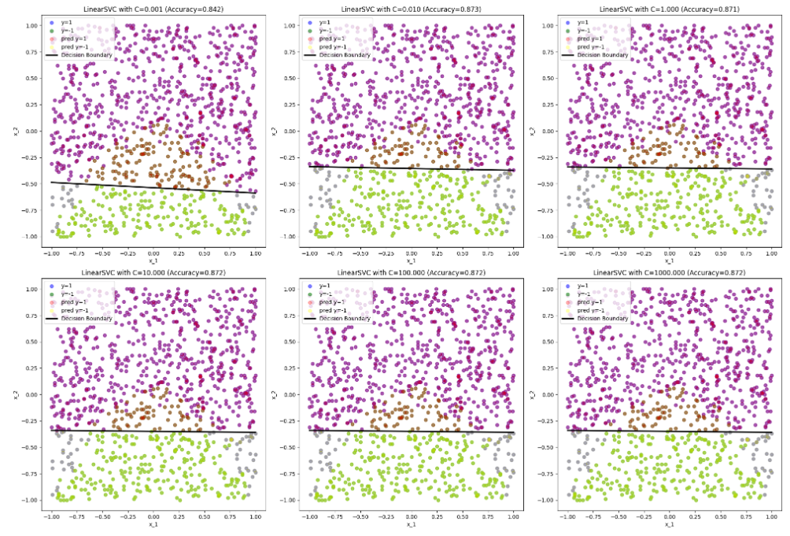

# Week2 Assignment Report

### Dataset id:20--40--20 

## (a)

<div>
<center>

<br>
Visualised data graph
</center> 
</div>


(i) The markers indicating each class are shown on the bottom left. The graph is also similar to that shown in the document. 

(ii) The decision boundary calculated by a logistic model can be written as:

$$
θ_0+θ_1x_1+θ_2x_2=0
$$
And we can get the coefficient set and the intercept: [-0.22837554 -3.78783103] and [-2.3368173], indicating:
$$
θ_0 = -2.3368173, θ_1 = -0.22837554 , θ_2 = -3.78783103
$$
Thus, the boundary can be written as:
$$
-0.22837554x_1-3.78783103x_2-2.3368173=0
$$
Then we can rewrite it to:
$$
x_2=\frac{-2.3368173-0.22837554x_1}{3.78783103}
$$


(iii) Then according to the equation above, we can obtain the following graph. The black line in the center is the decision boundary and all +1 predictions are above the boundary and all -1 predictions are below it.  And these circles with two colors mixed in them mean the prediction failed.
<div>
<center>

<br>
decision boundary
</center> 
</div>


(iv) The decision boundary is linear but the dataset is non-linear, so the predictions can't match the labels. According to the distribution of the points, the boundary should be quadratic thus it's underfitting.

## (b)

(i)&(ii) First we need to set a list of candidate values of 'C' : 0.001, 0.01, 1, 10, 100, 1000. For better comparison we also need to control the parameters, therefore, all parameters except 'C' are remaining the same during the experiment. And all graphs with accuracies shown below: 

<div>
<center>

</center> 
</div>

(iii) From the questions(i)&(ii) we can also obtain new parameter values:
$$
When~C=0.001,θ_0=-0.36129384, θ_1=-0.00950201, θ_2=-0.33388834
$$

$$
When~C=0.01,θ_0=-0.57489346, θ_1=-0.05196771, θ_2=-0.83495225
$$

$$
When~C=1,θ_0=-0.8201125, θ_1=-0.1015029, θ_2=-1.37552596
$$

$$
When~C=10,θ_0=-0.82692737, θ_1=-0.10226419, θ_2=-1.38886736
$$

$$
When~C=100,θ_0=-0.82761977, θ_1=-0.10233955, θ_2=-1.39022149
$$

$$
When~C=1000,θ_0=-0.82768908, θ_1=-0.10234709, θ_2=-1.39035704
$$

The value of C will highly affect the penalty. According to the graph we got from question(i)&(ii) above shows the accuracy trend regarding the change of 'C'. 'C' stands for the regularization strength. A small C would allow the model to accept a smaller margin, if the margin can separate most of the points. On the other hand, a larger C would force the model to maximize the margin and may harm the classification performance. The SVM model can also reach the best performance with a medium value of C, which aids the model to avoid overfitting or underfitting.

(iv) The shape of the boundaries are similar. The value of C brings large differences to the model's accuracy on the same dataset. However, this parameter has little effect on the logistic regression model.

## (c)

(i) After adding the additional features, the new model will be: 
$$
θ_0+θ_1x_1+θ_2x_2+θ_3x_1^2+θ_4x_2^2=0
$$
Then we can use the the same classifier from the first question to get the new parameters:
$$
θ_0=-0.84932739, θ_1=-0.26351517, θ_2=-5.58914409, θ_3=-8.05352584, θ_4=0.03097916
$$


<div>
<center>

<br>
Visualised data graph with new features
</center> 
</div>

(ii)&(iii) Then we can get the new graph as shown above. The results predicted by the model are different from the former models. It is apparent that the shape of the decision boundaries vary, but it is difficult to calculate the boundary of a quadratic model. And we can know from the previous questions that the linear model is unable to predict the points labeled “-1” but the quadratic model can handle these samples. In addition, the accuracy of this model is 0.97, much higher than the linear model trained with the same parameters. 


## Appendix

```python
import numpy as np
import matplotlib.pyplot as plt
from sklearn.linear_model import LogisticRegression
from sklearn import svm
# id:20--40--20

#(a) (i)
# load the dataset
file = open('week2.txt', 'r') 
data = np.array([line.strip().split(',') for line in file.readlines()]).astype(float)
# Separate the Xs and ys, and create two index lists
x = data[:, :2]
y = data[:, 2]
index1 = [i for i in range(len(y)) if y[i] == 1]
index2 = [i for i in range(len(y)) if y[i] == -1]
# Visualize the data
plt.figure()
plt.scatter(x[index1, 0], x[index1, 1], color='blue', label='y=1')
plt.scatter(x[index2, 0], x[index2, 1], color='green', label='y=-1')
plt.legend()
plt.xlabel('x_1')
plt.ylabel('x_2')
plt.show()

#(a) (ii)
clf = LogisticRegression(solver='saga',penalty='l2', C=1, max_iter=100).fit(x, y)
pred = clf.predict(x)
pred_index1 = [i for i in range(len(y)) if pred[i] == 1]
pred_index2 = [i for i in range(len(y)) if pred[i] == -1]

# Get the coefficient and intercept 
coef = clf.coef_[0]
intercept = clf.intercept_
print(coef)
print(intercept)

#(a) (iii)
# Obtain the decision boundary
x1 = np.linspace(-1, 1, 10)
x2 = (-intercept-x1*coef[0])/coef[1]
# Visualize the result
plt.figure()
plt.scatter(x[index1, 0], x[index1, 1], color='blue', label='y=1', alpha=0.5)
plt.scatter(x[index2, 0], x[index2, 1], color='green', label='y=-1', alpha=0.5)

plt.scatter(x[pred_index1, 0], x[pred_index1, 1], color='red', label='pred y=1', alpha=0.3)
plt.scatter(x[pred_index2, 0], x[pred_index2, 1], color='yellow', label='pred y=-1', alpha=0.3)

plt.plot(x1, x2, label='Decision Boundary', color='black', linewidth=2.5)
plt.legend()
plt.xlabel('x_1')
plt.ylabel('x_2')
plt.show()

#(b) (i)&(ii)
penalties = [0.001, 0.01, 1, 10, 100, 1000]
accuracies = []
plt.figure(figsize=[20, 20])
for index in np.arange(len(penalties))+1:
    plt.subplot(3, 3, index)
    
    # Model construction
    clf = svm.LinearSVC(C=penalties[index-1],dual=False).fit(x, y)
    # Predict the values and calculate the accuracy
    acc = clf.score(x, y)
    accuracies.append(acc)
    pred = clf.predict(x)
    pred_index1 = [i for i in range(len(y)) if pred[i] == 1]
    pred_index2 = [i for i in range(len(y)) if pred[i] == -1]
    # Get the coefficient and intercept to obtain the decision boundary
    coef = clf.coef_[0]
    intercept = clf.intercept_

    x1 = np.linspace(-1, 1, 10)
    x2 = (-intercept-x1*coef[0])/coef[1]
    
    plt.scatter(x[index1, 0], x[index1, 1], color='blue', label='y=1', alpha=0.5)
    plt.scatter(x[index2, 0], x[index2, 1], color='green', label='y=-1', alpha=0.5)

    plt.scatter(x[pred_index1, 0], x[pred_index1, 1], color='red', label='pred y=1', alpha=0.3)
    plt.scatter(x[pred_index2, 0], x[pred_index2, 1], color='yellow', label='pred y=-1', alpha=0.3)

    plt.plot(x1, x2, label='Decision Boundary', color='black', linewidth=2.5)
    plt.title('LinearSVC with C=%.3f (Accuracy=%.3f)'%(penalties[index-1], acc))
    plt.legend()
    plt.xlabel('x_1')
    plt.ylabel('x_2')
    
plt.tight_layout()
plt.show()

#(c) (i)
# Add additional features
x_quad = np.concatenate(([x[:, 0]], [x[:, 1]], [x[:, 0]**2], [x[:, 1]**2])).T
# Fit the model
clf = LogisticRegression(solver='saga',penalty='l2', C=1, max_iter=100).fit(x_quad, y)
score = clf.score(x_quad, y)
# Get the new coefficient and intercept
coef = clf.coef_[0]
intercept = clf.intercept_
print(intercept)
print(coef)
print(score)

#(c) (ii)
pred = clf.predict(x_quad)
pred_index1 = [i for i in range(len(y)) if pred[i] == 1]
pred_index2 = [i for i in range(len(y)) if pred[i] == -1]
# Visualize the result
plt.figure()
plt.scatter(x[index1, 0], x[index1, 1], color='blue', label='y=1', alpha=0.5)
plt.scatter(x[index2, 0], x[index2, 1], color='green', label='y=-1', alpha=0.5)

plt.scatter(x[pred_index1, 0], x[pred_index1, 1], color='red', label='pred y=1', alpha=0.3)
plt.scatter(x[pred_index2, 0], x[pred_index2, 1], color='yellow', label='pred y=-1', alpha=0.3)

plt.legend()
plt.xlabel('x_1')
plt.ylabel('x_2')
plt.show()
```

