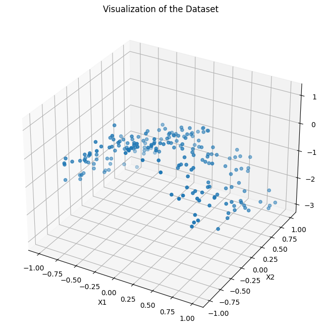
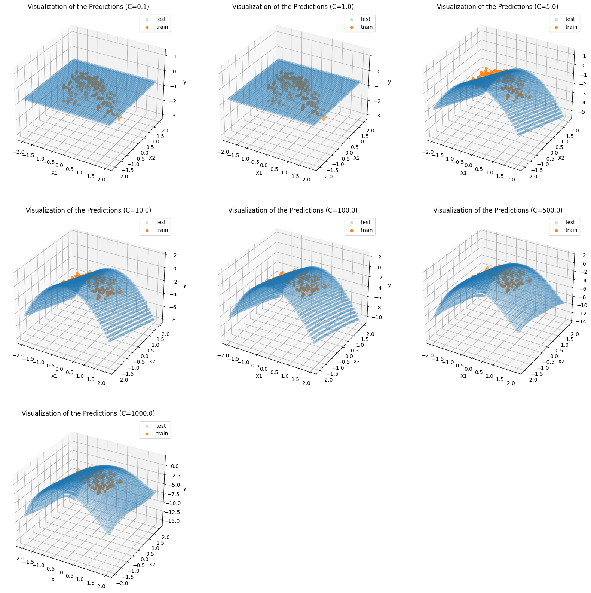
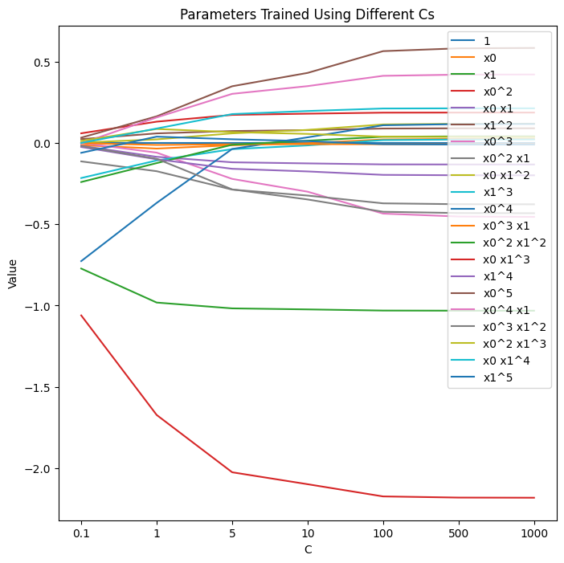
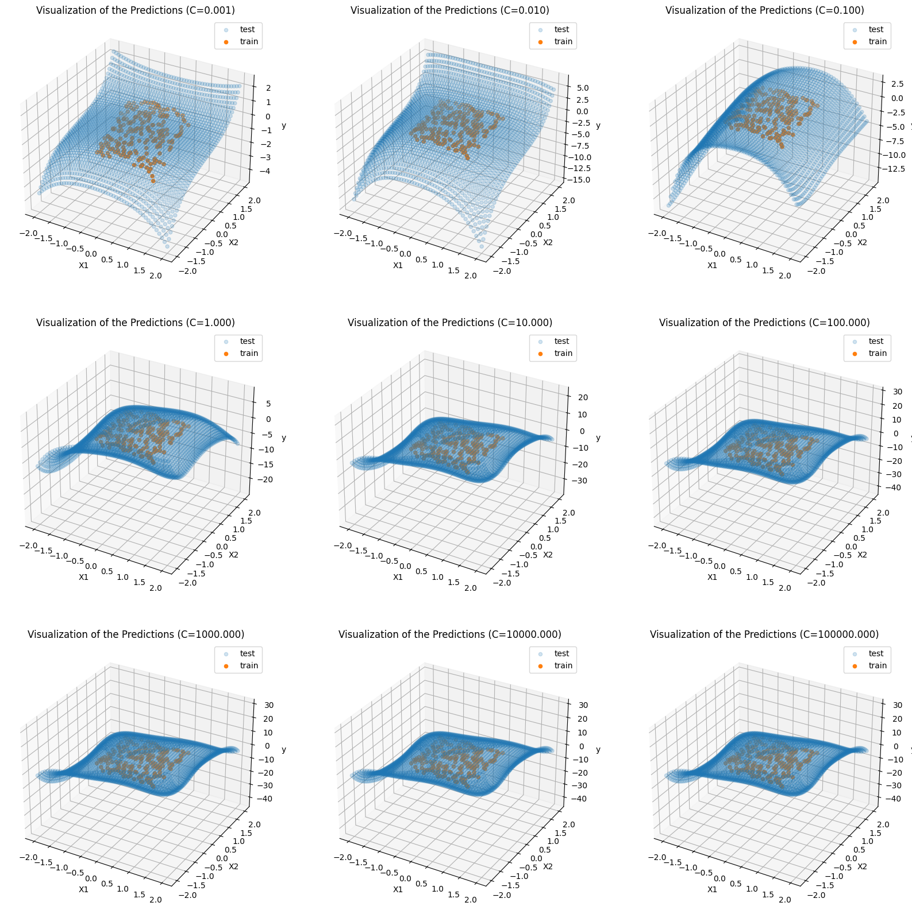
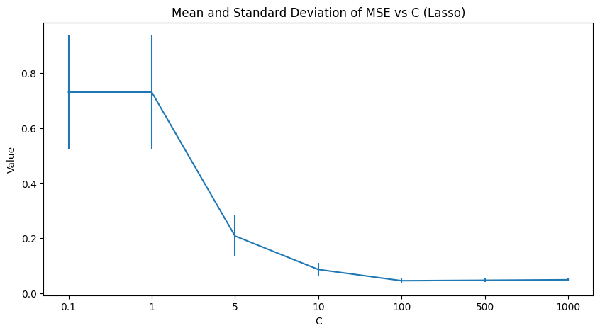
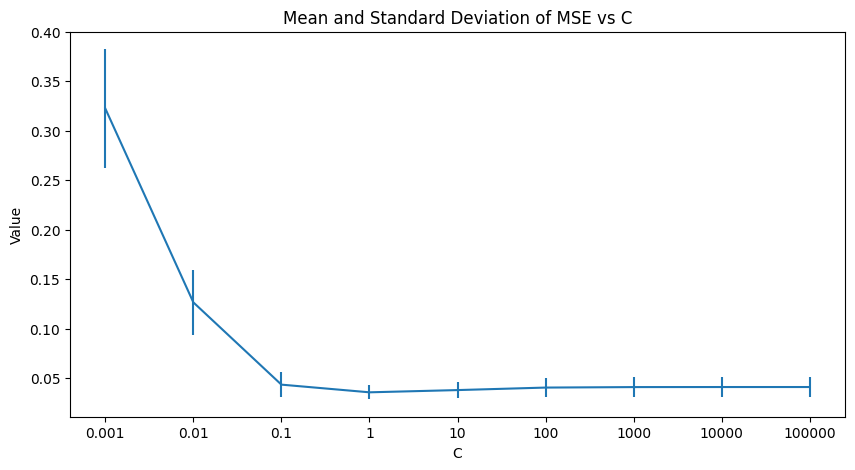

# Week3 Assignment Report

### Data id:14--28--14 

## (i)

(a) The 3D scatter plot below is the graph of the visualized dataset, and we can tell that those data points look like lying on a curve. 

<div> 
<center>

</center>
</div> 


(b) For reproduction, we fixed the random state to 0, and the list of C used for the experiment is [0.1, 1, 5, 10, 100, 500, 1000]. Then for better observation, we could generate a plot as below to find out the trend of the trained parameters

```python
c_list = [0.1, 1, 5, 10, 100, 500, 1000]
alpha = 1/(2*c)
clf = linear_model.Lasso(random_state=0, alpha=alpha)
```


<div> 
<center>

</center>
</div>

And we can also obtain the parameter values:
$$
When \ C \ is \ 0.1, \ θ \ is\quad[ 0. -0. -0. -0. -0. -0. -0. -0. -0. -0. -0. -0. -0. \\-0. -0. -0. -0. -0.
 -0. -0. -0.]
$$

$$
When \ C \ is \ 1,\ θ \ is \quad [ 0. -0. -0. -0. -0. -0. -0. -0. -0. -0. -0. -0. -0. -0. -0. -0. -0. -0.
 \\-0. -0. -0.]
$$

$$
When \ C \ is \ 5,\ θ \ is \quad [ 0.         -0.         -0.6803929  -0.93108058 -0.         -0.
 -0.         -0.         -0.         -0.         -0.         -0.
 -0.          0.         -0.         -0.    \\     -0.         -0. 
 -0.         -0.         -0.        ]
$$

$$
When \ C \ is \ 10,\ θ \ is \quad [ 0.         -0.         -0.86594124 -1.50202448 -0.         -0.
 -0.         -0.         -0.         -0.         -0.         -0.
 -0.          0.         -0.         -0.     \\    -0.         -0.
 -0.         -0.         -0.        ]
$$

$$
When \ C \ is \ 100,\ θ \ is \quad [ 0.          0.         -1.0327641  -2.01518063 \quad 0.         -0.
  0.         -0.         -0.         -0.         -0.          0.
 -0.          0.         -0.01732189 \quad 0.   \\      -0.         -0.
 -0.         -0.         -0.        ]
$$

$$
When \ C \ is \ 500,\ θ \ is \quad [ 0.     \quad    -0.01588659\quad -1.04777666 \quad-2.06265978 \quad-0.00801926\quad -0.\quad
  0.     \quad  -0.     \quad   \\  0.      \quad    0.     \quad    -0.      \quad   -0.\quad
 -0.        \quad  0.02595579  -0.06479348 \quad 0.05275606\quad  0.  \quad       -0.\quad
  0.      \quad    0.    \quad      0.    \quad    ]
$$

$$
When \ C \ is \ 1000,\ θ \ is \quad [ 0.    \quad     -0.03061585\quad -1.05258724\quad -2.06786679 \quad-0.07360959\quad -0.\quad
 -0.    \quad    \\ -0.   \quad       0.      \quad    0.      \quad    0.      \quad   -0.\quad
 -0.      \quad    0.11961047  -0.06866554\quad  0.07756016 \quad 0.0085111  \quad-0.00577164\quad\\
  0.        \quad  0.01181523 \quad 0.        ]
$$

​	According to the plot and all the parameter values we can know that most parameter values remaining to be 0 until C increases to 100. As the value of C increases, the value of alpha decreases, which indicates a decrease in the strength of the penalty. We can see that there are two parameter values are greater than 0 when C < 100, and the corresponding features are  X<sub>0</sub> <sup>2</sup>and X<sub>1</sub> . And our model only imply these two features which makes the model look like a plan, thus I think it's also an underfitting. In addition, after C > 100 there are more parameter values becomes greater than 0, which is a kind of overfitting.  Also the lasso regression restricts the redundant parameters, therefore parameter values will have larger differences as the value of C increases. 

(c)  By using the test grid, a prediction surface is generated as below. The training samples proffer our knowledge about the real labels, therefore a good fit is equal to the training samples lying on the prediction surface. For better visualization, we generated a grid from -2 to 2. We are expecting a curvy surface, and from the graph, we can assert setting C to 100 gives us a good fit. On the other hand, when C is less than 1, the model failed to fit. Another piece of evidence is that all the parameters are 0 when C is too small. However, when C is too large, the surface becomes too curvy that it may lose generalizability. 

<div> 
<center>

</center>
</div>

(d) Underfitting means a model failed to fit on the training set, as it obtains little knowledge about the samples. The first two subplots in (c) show cases of underfitting. Conversely, overfitting indicates the model learned too much knowledge about the training set, thus it can only predict the specific set and has poor generalizability on the testing sets. For instance, the last two subplots in the last problem are visualizations for overfitting. In other words, underfitting has low variance but high bias, and results in a simple model; overfitting has a low bias but high variance and results in a very complex model. Either model is unsatisfying. To obtain a good fit, the strength of restriction should be moderate. Setting C to around 100 could provide us with a good fit for this dataset. 

(e) The following graph shows the parameter values as C varies. It can observe that when applying ridge regression, most parameter values are not zero even if C is very small, and every parameter values are expanding when the value of C increases. Moreover, parameter values changes more smoothly. The similarity between the parameter values trained by the two approaches is that they share a similar overall increase trend. 

<div> 
<center>

</center>
</div>
And the new parameter values are:
$$
When \ C \ is \ 0.1, \ θ \ is\quad[ 0.00000000e+00\quad -1.35443455e-02 \quad-7.72295230e-01 \quad-1.06042172e+00\quad \\
 -1.73953142e-02  \quad2.36536033e-02 \quad 3.49005858e-04\quad -1.13203264e-01\quad \\
  2.22749144e-03\quad -2.15522438e-01\quad -7.26509218e-01\quad -1.01561510e-03\quad \\
 -2.40102839e-01 \quad 5.95142371e-02 \quad-2.46576227e-02\quad  3.28310760e-02\quad \\
 -1.95283989e-03\quad -1.92436108e-02 \quad 1.28663919e-02\quad  2.99070616e-04\quad\\
 -6.03935024e-02]
$$

$$
When \ C \ is \ 1, \ θ \ is\quad[ 0.     \quad    -0.03430445 \quad-0.98140241\quad -1.67284647\\ -0.08498967\quad  0.05909102\quad
 -0.05934594\quad -0.17358945 \\ 0.02224946\quad -0.10741457 \quad-0.36843846\quad -0.012031\quad
 -0.12367714 \\ 0.13116568 \quad-0.10021716 \quad 0.16401253 \quad 0.15727365\\ -0.09720448\quad
  0.08616842 \quad 0.08903423 \quad 0.0390254 ]
$$

$$
When \ C \ is \ 5, \ θ \ is\quad[ 0.    \quad     -0.01395622\quad -1.01723555 \quad-2.02522765\\ -0.11872868\quad  0.07355937\quad
 -0.22083621 \quad-0.28666379 \\ 0.05928066 \quad-0.03792016\quad -0.03675915\quad -0.00815416\\
 -0.010702  \quad  0.17285026 \quad-0.15870678\quad  0.34897015\\  0.30222519\quad -0.28542038\quad
  0.06690963  \quad0.17782774 \quad 0.02289217]
$$

$$
When \ C \ is \ 10, \ θ \ is\quad[ 0.00000000e+00 \quad -1.51879825e-03 \quad\quad-1.02348816e+00 \quad-2.09869399e+00\\
 -1.25462380e-01 \quad7.92020314e-02 \quad-2.99569101e-01\quad -3.23372278e-01\\
  8.04836522e-02 \quad-1.47928909e-02 \quad 3.48722768e-02\quad -7.15485976e-03\\
  1.41289788e-02 \quad 1.80282916e-01 \quad-1.74950287e-01  \quad4.31091674e-01\\
  3.49754662e-01\quad -3.47382789e-01 \quad 5.58604187e-02 \quad 1.96717906e-01\quad
  1.13612031e-02]
$$

$$
When \ C \ is \ 100, \ θ \ is\quad[ 0.    \quad      0.0217433 \quad -1.03063356 \quad-2.1738563 \\ -0.13158415\quad  0.0889344\quad
 -0.43429515 \quad-0.37118123 \\ 0.11402893 \quad 0.01777021 \quad 0.10916822 \quad-0.00761001\\
  0.03840823 \quad 0.1866018 \quad -0.19606643 \quad 0.56495584  \\0.41316301\quad -0.42302845\quad
  0.03898079 \quad 0.2121067 \quad -0.00718717]
$$

$$
When \ C \ is \ 500, \ θ \ is\quad[ 0.     \quad     0.02496879 \quad-1.03138933 \quad-2.18092874\\ -0.13207718\quad  0.09022909\quad
 -0.45211536\quad -0.37650491 \\ 0.11809316 \quad 0.02156698 \quad 0.11623946\quad -0.00782888\\
  0.04053139 \quad 0.18708215\quad -0.19845792 \quad 0.5821984  \\ 0.42034003\quad -0.43090249\quad
  0.03694362\quad  0.21315735 \quad-0.00946407]
$$

$$
When \ C \ is \ 1000, \ θ \ is\quad[ 0.      \quad    0.02539244\quad -1.03148562\quad -2.18181649 \\-0.13213753 \quad 0.09039832\quad
 -0.45444362\quad -0.37718674 \\ 0.11861722 \quad 0.02205522\quad  0.1171284 \quad -0.00785973\\
  0.04079462 \quad 0.18714048 \quad-0.19876509 \quad 0.58444459 \\ 0.42126088 \quad-0.43190095\quad
  0.03668072 \quad 0.21328246 \quad-0.00975813]
$$

This graph contains subplots showing the prediction surfaces. A good fit is reached when C is 1:

<div> 
<center>

</center>
</div>


## (ii)

(a) We keep using the previous C list for better comparison. According to the generated graph, we can see that the mean error has a descending trend. The standard deviation also shrinks as C increases. However, the mean error value has a steady trend when C is larger than 100. 

<div> 
<center>

</center>
</div>


(b) The mean value shows the average level of the error, while the standard deviation indicates the overall correctness in the prediction. If the standard deviation is large, then there may exist several wrong predictions. On the other hand, a small standard deviation means the model has an average error level on every sample. Thus we should find a model which has a balanced mean and standard deviation of the prediction error on an independent test set to ensure good performances. As the graph shown in the last question, the minimum mean error was reached at C=100, and the standard deviation calculated on the test set is also small. In this case, I would recommend 100 as the final value of C.

(c) Similarly, we tested on the previous C list using ridge regression. Using the method we mentioned in the last problem, 1 should be the final value of C, as it shows the least mean and standard deviation of the prediction error.

<div> 
<center>

</center>
</div>


# Appendix

```python
import matplotlib.pyplot as plt
from mpl_toolkits.mplot3d import Axes3D
import numpy as np
from sklearn.preprocessing import PolynomialFeatures
from sklearn import linear_model
from sklearn.model_selection import KFold
from sklearn.metrics import mean_squared_error
from matplotlib.ticker import LinearLocator

# Data id:14--28--14  

# Load the data
file = open("week3.txt", "r")
data = [line.strip() for line in file.readlines()]
data = [line.split(",") for line in data]

# Convert to numpy array
data = np.array(data).astype(float)

# Capture the Xs and ys
X = data[:, :2]
y = data[:, 2]

# Plot the graph
fig = plt.figure(figsize=[8, 8])
ax = fig.add_subplot(111 , projection ='3d')
ax.scatter(X[:, 0], X[:, 1], y)
ax.set_title("Visualization of the Dataset")
ax.set_xlabel("X1")
ax.set_ylabel("X2")
ax.set_zlabel("y")
plt.show()

# Create new features
poly = PolynomialFeatures(5)
poly_X = poly.fit_transform(X)
names = poly.get_feature_names_out()

# Train a list of models
parameters = []
c_list = [0.1, 1, 5, 10, 100, 500, 1000]
for c in c_list:
    # Transfer C to alpha
    alpha = 1/(2*c)
    clf = linear_model.Lasso(random_state=0, alpha=alpha)
    clf.fit(poly_X, y)
    parameters.append(clf.coef_)
    print("C is", c ,clf.coef_)
    
parameters = np.array(parameters).T

# Visualization
plt.figure(figsize=[8, 8])
plt.title("Parameters Trained Using Different Cs")
for i in range(len(parameters)):
    plt.plot(np.arange(len(c_list)), parameters[i], label=names[i])
plt.xlabel("C")
plt.xticks(np.arange(len(c_list)), c_list)
plt.ylabel("Value")
plt.legend(loc='upper left')
plt.show()

# Generate a grid
Xtest =[ ]
grid =np.linspace(-2, 2)
for i in grid:
    for j in grid:
        Xtest.append([i, j])
Xtest = np.array(Xtest)

# Generate the polynomial features
poly_Xtest = poly.fit_transform(Xtest)

# Train a list of models and make predictions
c_list = [0.1, 1, 5, 10, 100, 500, 1000]
predictions = []
for c in c_list:
    # Transfer C to alpha
    alpha = 1/(2*c)
    clf = linear_model.Lasso(random_state=0, alpha=alpha)
    clf.fit(poly_X, y)
    predictions.append(clf.predict(poly_Xtest))

# Generate the graphs
fig = plt.figure(figsize=[20, 20])
for i in range(len(c_list)):
    ax = fig.add_subplot(3, 3, i+1, projection ='3d')
    # Predictions
    ax.scatter(Xtest[:, 0], Xtest[:, 1], predictions[i], alpha=0.2, label="test")
    # Training samples
    ax.scatter(X[:, 0], X[:, 1], y, label="train")
    ax.set_title("Visualization of the Predictions (C=%.1f)"%c_list[i])
    ax.set_xlabel("X1")
    ax.set_ylabel("X2")
    ax.set_zlabel("y")
    plt.legend()
plt.show()

# Train a list of models, capture the parameters and predictions
parameters = []
predictions = []
c_list = [0.1, 1, 5, 10, 100, 500, 1000]
for c in c_list:
    # Transfer C to alpha
    alpha = 1/(2*c)
    clf = linear_model.Ridge(random_state=0, alpha=alpha)
    clf.fit(poly_X, y)
    parameters.append(clf.coef_)
    predictions.append(clf.predict(poly_Xtest))
    print("C is", c ,clf.coef_)
    
parameters = np.array(parameters).T

# Visualization (parameters)
plt.figure(figsize=[8, 8])
plt.title("Parameters Trained Using Different Cs")
for i in range(len(parameters)):
    plt.plot(np.arange(len(c_list)), parameters[i], label=names[i])
plt.xlabel("C")
plt.xticks(np.arange(len(c_list)), c_list)
plt.ylabel("Value")
plt.legend(loc='upper right')
plt.show()

# Generate the graphs (predictions)
fig = plt.figure(figsize=[20, 20])
for i in range(len(c_list)):
    ax = fig.add_subplot(3, 3, i+1, projection ='3d')
    # Predictions
    ax.scatter(Xtest[:, 0], Xtest[:, 1], predictions[i], alpha=0.2, label="test")
    # Training samples
    ax.scatter(X[:, 0], X[:, 1], y, label="train")
    ax.set_title("Visualization of the Predictions (C=%.3f)"%c_list[i])
    ax.set_xlabel("X1")
    ax.set_ylabel("X2")
    ax.set_zlabel("y")
    plt.legend()
plt.show()

# A list of C
c_list = [0.1, 1, 5, 10, 100, 500, 1000]

# Create k folds
kf = KFold(5, shuffle=True, random_state=0)
datasets = [dataset for dataset in kf.split(poly_X)]

# Test on different Cs
means = []
stds = []
for c in c_list:
    alpha = 1/(2*c)
    model = linear_model.Lasso(random_state=0, alpha=alpha)
    errors = []
    for [train_indices, test_indices] in datasets:
        # Fit the model
        model.fit(poly_X[train_indices], y[train_indices])
        # Make predictions
        ypred = model.predict(poly_X[test_indices])
        # Calculate MSE
        errors.append(mean_squared_error(y[test_indices], ypred))
    means.append(np.array(errors).mean())
    stds.append(np.array(errors).std())
    
# Plot the graph
plt.figure(figsize=[10, 5])
plt.errorbar(np.arange(len(c_list)), means, stds)
plt.xticks(np.arange(len(c_list)), c_list)
plt.xlabel("C")
plt.ylabel("Value")
plt.title("Mean and Standard Deviation of MSE vs C (Lasso)")
plt.show()

# A list of C
c_list = [0.1, 1, 5, 10, 100, 500, 1000]

# Create k folds
kf = KFold(5, shuffle=True, random_state=0)
datasets = [dataset for dataset in kf.split(poly_X)]

# Test on different Cs
means = []
stds = []
for c in c_list:
    alpha = 1/(2*c)
    model = linear_model.Ridge(random_state=0, alpha=alpha)
    errors = []
    for [train_indices, test_indices] in datasets:
        # Fit the model
        model.fit(poly_X[train_indices], y[train_indices])
        # Make predictions
        ypred = model.predict(poly_X[test_indices])
        # Calculate MSE
        errors.append(mean_squared_error(y[test_indices], ypred))
    means.append(np.array(errors).mean())
    stds.append(np.array(errors).std())
    
# Plot the graph
plt.figure(figsize=[10, 5])
plt.errorbar(np.arange(len(c_list)), means, stds)
plt.xticks(np.arange(len(c_list)), c_list)
plt.xlabel("C")
plt.ylabel("Value")
plt.title("Mean and Standard Deviation of MSE vs C (Ridge)")
plt.show()
```
