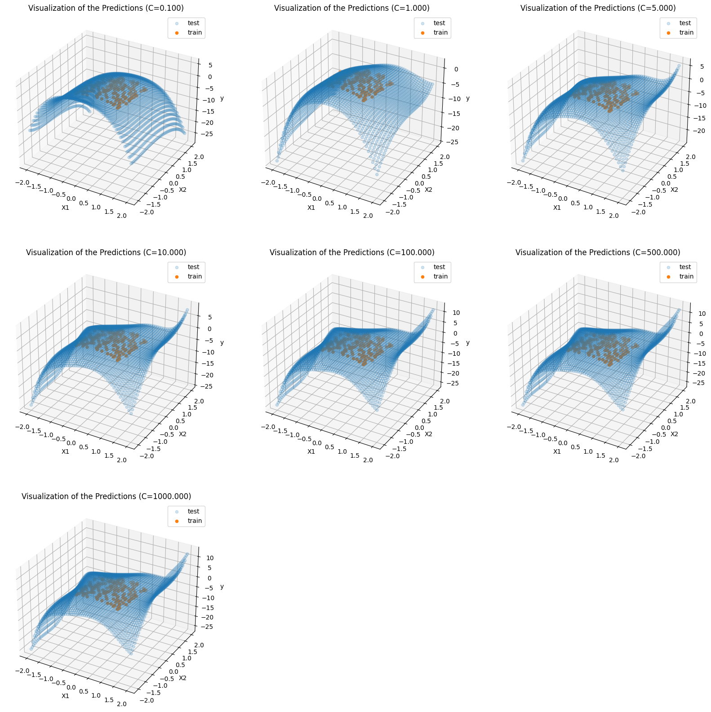
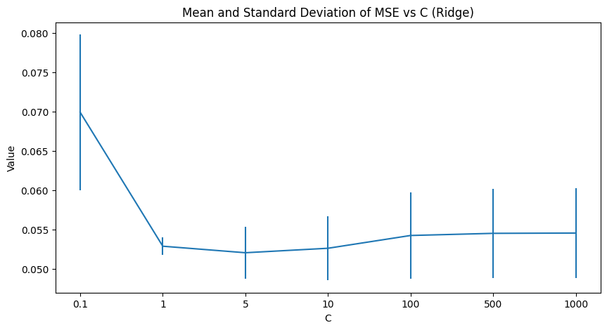

# Week3 Assignment Report

### Data id:14--28--14 

## (i)

<div> 
<center>

<br>
Visualized dataset graph
</center>
</div> 

(a) The 3D scatter plot above is the graph of the visualized dataset, and we can tell that those data points look like lying on a curve. 

(b) For reproduction, we fixed the random state to 0, and the list of C used for the experiment is [0.1, 1, 10, 100, 1000, 10000, 100000]. For better visualization, we generated a plot to find out the trend of the trained parameters

<div> 
<center>

</center>
</div>

The plot shows that the parameter set is no longer an array of zeros when C is larger than 1. As the value of C increases, the value of alpha decreases, which indicates a decrease in the strength of the penalty. We can notice that there are two parameters varied from 0 when C increased to 1, and the corresponding variables are  X<sub>0</sub> and X<sub>1</sub> . The other parameters remained to be 0 until C is larger than 100. Lasso regression restricts the redundant parameters, therefore the value of the parameters would have larger differences as the value of C increases. 


<div> 
<center>

</center>
</div>

(c)  By using the test grid, a prediction surface is generated. The training samples proffer our knowledge about the real labels, therefore a good fit is equal to the training samples lying on the prediction surface. For better visualization, we generated a grid from -2 to 2. We are expecting a curvy surface, and from the graph, we can assert setting C to 1000 gives us a good fit. On the other hand, when C is less than 1, the model failed to fit. Another piece of evidence is that all the parameters are 0 when C is too small. However, when C is too large, the surface becomes too curvy that it may lose generalizability. 

(d) Under-fitting means a model failed to fit on the training set, as it obtains little knowledge about the samples. The first two subplots in (c) show cases of under-fitting. Conversely, over-fitting indicates the model learned too much knowledge about the training set, thus it can only predict the specific set and has poor generalizability on the testing sets. For instance, the last two subplots in the last problem are visualizations for over-fitting. In other words, under-fitting has low variance but high bias, and results in a simple model; over-fitting has a low bias but high variance and results in a very complex model. Either model is unsatisfying. To obtain a good fit, the strength of restriction shall be moderate. Setting C to around 1000 could provide us with a good fit for this project. 

(e) The following graph shows the value of parameters as C varies. It can be observed that when applying ridge regression, the parameter set will not be an array of zeros even if C is very small, and every parameter are expanding when the value of C increases. Moreover, the value of parameters changes more smoothly. The similarity between the parameter sets trained by the two approaches is that they share a similar overall evolution trend. 

<div> 
<center>

</center>
</div>

The this graph contains subplots showing the prediction surfaces. A good fit is reached when C is larger than 1 but less than 10:

<div> 
<center>

</center>
</div>


## (ii)

(a) We keep using the previous C list for better comparison. With the assistant of the generated graph, we can see that the mean error has a descending trend. The standard deviation also shrinks as C increases. However, the mean error value suffers a slight rise when C is larger than 100. 

<div> 
<center>

</center>
</div>


(b) The mean value shows the average level of the error, while the standard deviation indicates the overall correctness in the prediction. If the standard deviation is large, then there may exist several outrageous predictions. On the other hand, a small standard deviation means the model has an average error level on every sample. Thus we should find a model which has a balanced mean and standard deviation of the prediction error on an independent test set to promise good performances. As what was shown in the last question, the minimum mean error was reached at C=100, and the standard deviation calculated on the test set is also small. In this case, we would recommend 100 as the final value of C.

(c) Similarly, we tested on the previous C list using ridge regression. Using the standard we mentioned in the last problem, 1 shall be chosen as the final value of C, as it shows the least mean and standard deviation of the prediction error.

<div> 
<center>

</center>
</div>

# Appendix

```python
import matplotlib.pyplot as plt
from mpl_toolkits.mplot3d import Axes3D
import numpy as np
from sklearn.preprocessing import PolynomialFeatures
from sklearn import linear_model
from sklearn.model_selection import KFold
from sklearn.metrics import mean_squared_error
from matplotlib.ticker import LinearLocator
# Data id:14--28--14 

# Load the data
file = open("week3.txt", "r")
data = [line.strip() for line in file.readlines()]
data = [line.split(",") for line in data]

# Convert to numpy array
data = np.array(data).astype(float)

# Capture the Xs and ys
X = data[:, :2]
y = data[:, 2]

# Plot the graph
fig = plt.figure(figsize=[8, 8])
ax = fig.add_subplot(111 , projection ='3d')
ax.scatter(X[:, 0], X[:, 1], y)
ax.set_title("Visualization of the Dataset")
ax.set_xlabel("X1")
ax.set_ylabel("X2")
ax.set_zlabel("y")
plt.show()

# Create new features
poly = PolynomialFeatures(5)
poly_X = poly.fit_transform(X)
names = poly.get_feature_names_out()

# Train a list of models
parameters = []
c_list = [0.1, 1, 10, 100, 1000, 10000, 100000]
for c in c_list:
    # Transfer C to alpha
    alpha = 1/(2*c)
    clf = linear_model.Lasso(random_state=0, alpha=alpha)
    clf.fit(poly_X, y)
    parameters.append(clf.coef_)
    
parameters = np.array(parameters).T

# Visualization
plt.figure(figsize=[8, 8])
plt.title("Parameters Trained Using Different Cs")
for i in range(len(parameters)):
    plt.plot(np.arange(len(c_list)), parameters[i], label=names[i])
plt.xlabel("C")
plt.xticks(np.arange(len(c_list)), c_list)
plt.ylabel("Value")
plt.legend(loc='upper left')
plt.show()

# Generate a grid
Xtest =[ ]
grid =np.linspace(-2, 2)
for i in grid:
    for j in grid:
        Xtest.append([i, j])
Xtest = np.array(Xtest)

# Generate the polynomial features
poly_Xtest = poly.fit_transform(Xtest)

# Train a list of models and make predictions
c_list = [0.1, 1, 10, 100, 1000, 10000, 100000]
predictions = []
for c in c_list:
    # Transfer C to alpha
    alpha = 1/(2*c)
    clf = linear_model.Lasso(random_state=0, alpha=alpha)
    clf.fit(poly_X, y)
    predictions.append(clf.predict(poly_Xtest))

# Generate the graphs
fig = plt.figure(figsize=[20, 20])
for i in range(len(c_list)):
    ax = fig.add_subplot(3, 3, i+1, projection ='3d')
    # Predictions
    ax.scatter(Xtest[:, 0], Xtest[:, 1], predictions[i], alpha=0.2, label="test")
    # Training samples
    ax.scatter(X[:, 0], X[:, 1], y, label="train")
    ax.set_title("Visualization of the Predictions (C=%.1f)"%c_list[i])
    ax.set_xlabel("X1")
    ax.set_ylabel("X2")
    ax.set_zlabel("y")
    plt.legend()
plt.show()

# Train a list of models, capture the parameters and predictions
parameters = []
predictions = []
c_list = [0.001, 0.01, 0.1, 1, 10, 100, 1000, 10000, 100000]
for c in c_list:
    # Transfer C to alpha
    alpha = 1/(2*c)
    clf = linear_model.Ridge(random_state=0, alpha=alpha)
    clf.fit(poly_X, y)
    parameters.append(clf.coef_)
    predictions.append(clf.predict(poly_Xtest))
    
parameters = np.array(parameters).T

# Visualization (parameters)
plt.figure(figsize=[8, 8])
plt.title("Parameters Trained Using Different Cs")
for i in range(len(parameters)):
    plt.plot(np.arange(len(c_list)), parameters[i], label=names[i])
plt.xlabel("C")
plt.xticks(np.arange(len(c_list)), c_list)
plt.ylabel("Value")
plt.legend(loc='upper left')
plt.show()

# Generate the graphs (predictions)
fig = plt.figure(figsize=[20, 20])
for i in range(len(c_list)):
    ax = fig.add_subplot(3, 3, i+1, projection ='3d')
    # Predictions
    ax.scatter(Xtest[:, 0], Xtest[:, 1], predictions[i], alpha=0.2, label="test")
    # Training samples
    ax.scatter(X[:, 0], X[:, 1], y, label="train")
    ax.set_title("Visualization of the Predictions (C=%.3f)"%c_list[i])
    ax.set_xlabel("X1")
    ax.set_ylabel("X2")
    ax.set_zlabel("y")
    plt.legend()
plt.show()

# A list of C
c_list = [0.1, 1, 10, 100, 1000, 10000, 100000]

# Create k folds
kf = KFold(5, shuffle=True, random_state=0)
datasets = [dataset for dataset in kf.split(poly_X)]

# Test on different Cs
means = []
stds = []
for c in c_list:
    alpha = 1/(2*c)
    model = linear_model.Lasso(random_state=0, alpha=alpha)
    errors = []
    for [train_indices, test_indices] in datasets:
        # Fit the model
        model.fit(poly_X[train_indices], y[train_indices])
        # Make predictions
        ypred = model.predict(poly_X[test_indices])
        # Calculate MSE
        errors.append(mean_squared_error(y[test_indices], ypred))
    means.append(np.array(errors).mean())
    stds.append(np.array(errors).std())
    
# Plot the graph
plt.figure(figsize=[10, 5])
plt.errorbar(np.arange(len(c_list)), means, stds)
plt.xticks(np.arange(len(c_list)), c_list)
plt.xlabel("C")
plt.ylabel("Value")
plt.title("Mean and Standard Deviation of MSE vs C")
plt.show()

# A list of C
c_list = [0.001, 0.01, 0.1, 1, 10, 100, 1000, 10000, 100000]

# Create k folds
kf = KFold(5, shuffle=True, random_state=0)
datasets = [dataset for dataset in kf.split(poly_X)]

# Test on different Cs
means = []
stds = []
for c in c_list:
    alpha = 1/(2*c)
    model = linear_model.Ridge(random_state=0, alpha=alpha)
    errors = []
    for [train_indices, test_indices] in datasets:
        # Fit the model
        model.fit(poly_X[train_indices], y[train_indices])
        # Make predictions
        ypred = model.predict(poly_X[test_indices])
        # Calculate MSE
        errors.append(mean_squared_error(y[test_indices], ypred))
    means.append(np.array(errors).mean())
    stds.append(np.array(errors).std())
    
# Plot the graph
plt.figure(figsize=[10, 5])
plt.errorbar(np.arange(len(c_list)), means, stds)
plt.xticks(np.arange(len(c_list)), c_list)
plt.xlabel("C")
plt.ylabel("Value")
plt.title("Mean and Standard Deviation of MSE vs C")
plt.show()
```

