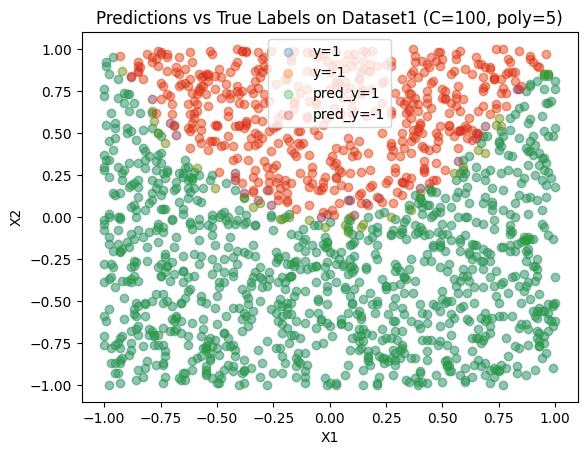

# Week4 Assignment Report

### Dataset 1 id: 5--10--5-1 ; Dataset 2 id: 5-5--5-1 

## (i)

(a) Accuracy and precision are metrics for evaluating a classification model. We could use accuracy as the measuring metric, as accuracy considers the overall result including both positive and negative classes. We choose the hyperparameter C from a list [0.01, 0.1, 1, 10, 100, 1000], and the maximum order of polynomials from [1, 2, 3, 5]. The best classifier shall have a high mean value of accuracy, while the standard deviation shall not be large. A small standard deviation indicates the model is robust on different datasets. For reproduction, we set all the random states to 0. Then we can generate a cross-validation graph as below:

<div> 
<center>

</center>
</div> 

​	As the graph shows, the mean value of the accuracy score has little difference between different maximum orders of polynomials selected when C is larger than 1. And we can also tell that the minimum standard deviation is reached by the model with poly=5 and C=100. Therefore, this model should be selected as the final model for classification, and then we can plot the prediction results as:

<div> 
<center>

</center>
</div> 

​	According the graph above the predictions and true labels are highly overlapped, indicating the model fits the dataset very well. 

(b) Firstly set a value k from 1 to 15. Similar to the last problem, we need to find a model with a high mean accuracy and low standard deviation. Then we can know that 15 should be the best value for k  from the graph below:

<div> 
<center>

</center>
</div> 

​	And the prediction result is: 

<div> 
<center>

</center>
</div> 

​	We know that the number of neighbors can't be too small or too large, otherwise the model will be overfitting, or randomly fit on the surrounding points, causing underfitting.

(c) We can use a standard logistic classifier as the baseline model. The model is trained with the basic features and the hyperparameters are not tuned except for the random state. Then we can get the confusion matrix as below:

| Baseline                    | Pre y = 1     | Pre y = -1     |
| --------------------------- | ------------- | -------------- |
| **True y = 1**              | 410           | 108            |
| **True y = -1**             | 96            | 953            |
| **Logistic Classification** | **Pre y = 1** | **Pre y = -1** |
| **True y = 1**              | 486           | 32             |
| **True y = -1**             | 25            | 1024           |
| **KNN**                     | **Pre y = 1** | **Pre y = -1** |
| **True y = 1**              | 483           | 35             |
| **True y = -1**             | 25            | 1024           |

(d) The following graph shows the ROC curves of the three models.

<div> 
<center>

</center>
</div> 

(e) A confusion matrix can illustrate the number of samples wrongly classified. We have the confusion matrices from the problem(c). We can see the two models have more correct predictions than the baseline model, while the logistic classifier is slightly more accurate than the KNN model. When evaluating with ROC curves, we know that a model is more ideal when it has a curve closer to the position [0, 1], the point indicating 0% false positive with 100% true positive. According to the graph that both logistic and KNN models are closer to the point than the baseline model is. Moreover, KNN generated a curve that is closest to the ideal point. There is no significant difference between the two models, and I would suggest using a logistic classifier as it is slightly better than the KNN model. 


## (ii)

(a) Using the same method as the question(i), get the cross-validation graph as below:

<div> 
<center>

</center>
</div> 

​	Although all the accuracies are low, we can still observe the accuracy drops when increasing the polynomial which means there's an overfitting. The accuracy also decreases when the value of C increases. Therefore, we should choose C=0.01 and poly=2 for the final logistic classifier. The prediction results are shown in the following graph, and we can tell that this dataset2 is too complex to be classified by a logistic classifier:

<div> 
<center>

</center>
</div> 

(b) According to the graph we can see there's a significant rise in the mean accuracy when select the number of neighbors for the KNN model. By observing the following graph, we can also select K=15 for the final model. 

<div> 
<center>

</center>
</div> 

<div> 
<center>

</center>
</div> 

​	And it's hard to say which model could perform better, as they both have low mean accuracies.

(c) We keep using the standard logistic classifier as the baseline model. The model is trained with the basic features and the hyperparameters are not tuned except for the random state. Then we can get the confusion matrix as below:

| Baseline                    | Pre y = 1     | Pre y = -1     |
| --------------------------- | ------------- | -------------- |
| **True y = 1**              | 0             | 386            |
| **True y = -1**             | 0             | 796            |
| **Logistic Classification** | **Pre y = 1** | **Pre y = -1** |
| **True y = 1**              | 0             | 386            |
| **True y = -1**             | 0             | 796            |
| **KNN**                     | **Pre y = 1** | **Pre y = -1** |
| **True y = 1**              | 61            | 325            |
| **True y = -1**             | 54            | 742            |

(d) The following graph shows the ROC curves of the three models.

<div> 
<center>

</center>
</div> 

(e) Although we don't know for sure which model is better to use from the first two problems. But the table from (c) and the graph from (d) can tell us the baseline model and the logistic classifier are making random predictions by classifying all the data into the negative class. The ROC curves of the two models also support this. In addition, the KNN model generates a curve closer to the ideal point, and several positive data are correctly classified. So I would suggest using KNN model for this dataset.


# Appendix

```python
import sklearn
import matplotlib.pyplot as plt
import numpy as np
from sklearn.linear_model import LogisticRegression
from sklearn.preprocessing import PolynomialFeatures
from sklearn.model_selection import KFold
from sklearn.metrics import accuracy_score, confusion_matrix, roc_curve
from sklearn.neighbors import KNeighborsClassifier
# Dataset 1 id: 5--10--5-1 ; Dataset 2 id: 5-5--5-1 

# Load the dataset
file = open("week4.txt", "r+")
dataset1, dataset2 = [], []

# determine which dataset to write in
flag = False

for line in file.readlines():
    if line.strip() == "# id:5--10--5-1":
        continue
    
    # Switch the flag
    if line.strip() == "# id:5-5--5-1":
        flag = True
        continue
        
    # Capture the data
    sample = np.array(line.strip().split(",")).astype(float)
    if flag:
        dataset1.append(sample)
    else:
        dataset2.append(sample)

# Convert to np and split x,y
dataset1 = np.array(dataset1); dataset2 = np.array(dataset2)
x_1, y_1= dataset1[:, :2], dataset1[:, 2]
index_pos_1 = [i for i in range(len(y_1)) if y_1[i] == 1]
index_neg_1 = [i for i in range(len(y_1)) if y_1[i] == -1]
x_2, y_2 = dataset2[:, :2], dataset2[:, 2]
index_pos_2 = [i for i in range(len(y_2)) if y_2[i] == 1]
index_neg_2 = [i for i in range(len(y_2)) if y_2[i] == -1]

# A search grid
c_list = [0.01, 0.1, 1, 10, 100, 1000]
poly_list = [1, 2, 3, 5]

score_mean, score_std = [], []
for poly in poly_list:
    # Create new features
    poly_x_1 = PolynomialFeatures(poly).fit_transform(x_1)
    means, stds = [], []
    for c in c_list:
        clf = LogisticRegression(random_state=0, penalty='l2', C=c, max_iter=1000)
        scores = []
        # Kfold validation
        for train, test in KFold(5).split(poly_x_1):
            clf.fit(poly_x_1[train], y_1[train])
            ypred = clf.predict(poly_x_1[test])
            scores.append(accuracy_score(y_1[test], ypred))
        # Fetch the mean and std of the scores
        means.append(np.array(scores).mean())
        stds.append(np.array(scores).std())
    score_mean.append(means)
    score_std.append(stds)

# Plot the errorbar
plt.figure()
plt.title("Errorbars for Cross Validation")
for i in range(len(poly_list)):
    plt.errorbar(np.arange(len(c_list)), score_mean[i], score_std[i], label="poly=%d"%poly_list[i])
plt.legend()
plt.xticks(np.arange(len(c_list)), c_list)
plt.xlabel("C")
plt.ylabel("Accuracy Score")
plt.show()

# Select C=100 and poly=5 for the final model
poly_x_1 = PolynomialFeatures(5).fit_transform(x_1)
clf =  LogisticRegression(random_state=0, penalty='l2', C=100, max_iter=1000)
clf.fit(poly_x_1, y_1)
y_pred = clf.predict(poly_x_1)
index_pos_pred = [i for i in range(len(y_pred)) if y_pred[i] == 1]
index_neg_pred = [i for i in range(len(y_pred)) if y_pred[i] == -1]
        
# Plot the first dataset
plt.figure()
plt.title("Predictions vs True Labels on Dataset1 (C=100, poly=5)")
plt.scatter(x_1[index_pos_1][:, 0], x_1[index_pos_1][:, 1], label="y=1", alpha=0.3)
plt.scatter(x_1[index_neg_1][:, 0], x_1[index_neg_1][:, 1], label='y=-1', alpha=0.3)
plt.scatter(x_1[index_pos_pred][:, 0], x_1[index_pos_pred][:, 1], label="pred_y=1", alpha=0.3)
plt.scatter(x_1[index_neg_pred][:, 0], x_1[index_neg_pred][:, 1], label='pred_y=-1', alpha=0.3)
plt.legend()
plt.xlabel("X1")
plt.ylabel("X2")
plt.show()

k_list = np.arange(30)+1
score_mean, score_std = [], []
for k in k_list:
    # Create classifiers
    scores = []
    knn = KNeighborsClassifier(n_neighbors=k)
    for train, test in KFold(5).split(x_1):
        knn.fit(x_1[train], y_1[train])
        ypred = knn.predict(x_1[test])
        scores.append(accuracy_score(y_1[test], ypred))
        # Fetch the mean and std of the scores
    score_mean.append(np.array(scores).mean())
    score_std.append(np.array(scores).std())

# Plot the errorbar
plt.figure(figsize=[10, 5])
plt.title("Errorbars for Cross Validation")
plt.errorbar(np.arange(len(k_list)), score_mean, score_std)
plt.xticks(np.arange(len(k_list)), k_list)
plt.xlabel("k"); plt.ylabel("Accuracy Score")
plt.show()

# Select K=15 for the final model
knn =  KNeighborsClassifier(n_neighbors=15).fit(x_1, y_1)
y_pred = knn.predict(x_1)
index_pos_pred = [i for i in range(len(y_pred)) if y_pred[i] == 1]
index_neg_pred = [i for i in range(len(y_pred)) if y_pred[i] == -1]
        
# Plot the first dataset
plt.figure()
plt.title("Predictions vs True Labels on Dataset1 (K=15)")
plt.scatter(x_1[index_pos_1][:, 0], x_1[index_pos_1][:, 1], label="y=1", alpha=0.3)
plt.scatter(x_1[index_neg_1][:, 0], x_1[index_neg_1][:, 1], label='y=-1', alpha=0.3)
plt.scatter(x_1[index_pos_pred][:, 0], x_1[index_pos_pred][:, 1], label="pred_y=1", alpha=0.3)
plt.scatter(x_1[index_neg_pred][:, 0], x_1[index_neg_pred][:, 1], label='pred_y=-1', alpha=0.3)
plt.legend()
plt.xlabel("X1")
plt.ylabel("X2")
plt.show()

# For comparison, a standard logistic classifier is created with the basic features
baseline = LogisticRegression(random_state=0)
baseline.fit(x_1, y_1)
ypred_baseline = baseline.predict(x_1)
print("Confusion matrix for the baseline model: ")
print(confusion_matrix(y_1, ypred_baseline))

# The other two models
poly_x_1 = PolynomialFeatures(5).fit_transform(x_1)
poly =  LogisticRegression(random_state=0, penalty='l2', C=100, max_iter=1000)
poly.fit(poly_x_1, y_1)
y_pred_logistic = poly.predict(poly_x_1)
print("Confusion matrix for the logistic classification model: ")
print(confusion_matrix(y_1, y_pred_logistic))

knn =  KNeighborsClassifier(n_neighbors=15).fit(x_1, y_1)
y_pred_knn = knn.predict(x_1)
print("Confusion matrix for the KNN model: ")
print(confusion_matrix(y_1, y_pred_knn))

# Curves of the models
fpr, tpr, _ = roc_curve(y_1, baseline.decision_function(x_1))
plt.plot(fpr, tpr, label="Baseline Model")
fpr, tpr, _ = roc_curve(y_1, poly.decision_function(poly_x_1))
plt.plot(fpr, tpr, label="Logistic Classifier")
# For KNN, we need to use the probabilities
fpr, tpr, _ = roc_curve(y_1, knn.predict_proba(x_1)[:, 1])
plt.plot(fpr, tpr, label="KNN")
plt.xlabel("False positive rate")
plt.ylabel("True positive rate")
plt.legend()
plt.plot([0, 1], [0, 1], color="yellow",linestyle="--")
plt.show()

# A search grid
c_list = [0.001, 0.01, 0.1, 1, 10, 100, 1000, 10000]
poly_list = [1, 2, 3, 5]

score_mean, score_std = [], []
for poly in poly_list:
    # Create new features
    poly_x_2 = PolynomialFeatures(poly).fit_transform(x_2)
    means, stds = [], []
    for c in c_list:
        clf = LogisticRegression(random_state=0, penalty='l2', C=c, max_iter=1000)
        scores = []
        # Kfold validation
        for train, test in KFold(5).split(poly_x_2):
            clf.fit(poly_x_2[train], y_2[train])
            ypred = clf.predict(poly_x_2[test])
            scores.append(accuracy_score(y_2[test], ypred))
        # Fetch the mean and std of the scores
        means.append(np.array(scores).mean())
        stds.append(np.array(scores).std())
    score_mean.append(means)
    score_std.append(stds)

# Plot the errorbar
plt.figure()
plt.title("Errorbars for Cross Validation")
for i in range(len(poly_list)):
    plt.errorbar(np.arange(len(c_list)), score_mean[i], score_std[i], label="poly=%d"%poly_list[i], alpha=0.5)
plt.legend()
plt.xticks(np.arange(len(c_list)), c_list)
plt.xlabel("C"); plt.ylabel("Accuracy Score")
plt.show()

# Select C=100 and poly=5 for the final model
poly_x_2 = PolynomialFeatures(2).fit_transform(x_2)
clf =  LogisticRegression(random_state=0, penalty='l2', C=0.01, max_iter=1000)
clf.fit(poly_x_2, y_2)
y_pred = clf.predict(poly_x_2)
index_pos_pred = [i for i in range(len(y_pred)) if y_pred[i] == 1]
index_neg_pred = [i for i in range(len(y_pred)) if y_pred[i] == -1]
        
# Plot the first dataset
plt.figure()
plt.title("Predictions vs True Labels on Dataset2 (C=0.01, poly=2)")
plt.scatter(x_2[index_pos_2][:, 0], x_2[index_pos_2][:, 1], label="y=1", alpha=0.5)
plt.scatter(x_2[index_neg_2][:, 0], x_2[index_neg_2][:, 1], label='y=-1', alpha=0.5)
plt.scatter(x_2[index_pos_pred][:, 0], x_2[index_pos_pred][:, 1], label="pred_y=1", alpha=0.5)
plt.scatter(x_2[index_neg_pred][:, 0], x_2[index_neg_pred][:, 1], label='pred_y=-1', alpha=0.5)
plt.legend()
plt.xlabel("X1")
plt.ylabel("X2")
plt.show()

k_list = np.arange(30)+1
score_mean, score_std = [], []
for k in k_list:
    # Create classifiers
    scores = []
    knn = KNeighborsClassifier(n_neighbors=k)
    for train, test in KFold(5).split(x_2):
        knn.fit(x_2[train], y_1[train])
        ypred = knn.predict(x_2[test])
        scores.append(accuracy_score(y_1[test], ypred))
        # Fetch the mean and std of the scores
    score_mean.append(np.array(scores).mean())
    score_std.append(np.array(scores).std())

# Plot the errorbar
plt.figure(figsize=[10, 5])
plt.title("Errorbars for Cross Validation")
plt.errorbar(np.arange(len(k_list)), score_mean, score_std)
plt.xticks(np.arange(len(k_list)), k_list)
plt.xlabel("k")
plt.ylabel("Accuracy Score")
plt.show()

# Select K=15 for the final model
knn =  KNeighborsClassifier(n_neighbors=15).fit(x_2, y_2)
y_pred = knn.predict(x_2)
index_pos_pred = [i for i in range(len(y_pred)) if y_pred[i] == 1]
index_neg_pred = [i for i in range(len(y_pred)) if y_pred[i] == -1]
        
# Plot the first dataset
plt.figure()
plt.title("Predictions vs True Labels on Dataset2 (K=15)")
plt.scatter(x_2[index_pos_2][:, 0], x_2[index_pos_2][:, 1], label="y=1", alpha=0.3)
plt.scatter(x_2[index_neg_2][:, 0], x_2[index_neg_2][:, 1], label='y=-1', alpha=0.3)
plt.scatter(x_2[index_pos_pred][:, 0], x_2[index_pos_pred][:, 1], label="pred_y=1", alpha=0.3)
plt.scatter(x_2[index_neg_pred][:, 0], x_2[index_neg_pred][:, 1], label='pred_y=-1', alpha=0.3)
plt.legend()
plt.xlabel("X1")
plt.ylabel("X2")
plt.show()

# For comparison, a standard logistic classifier is created with the basic features
baseline = LogisticRegression(random_state=0)
baseline.fit(x_2, y_2)
ypred_baseline = baseline.predict(x_2)
print("Confusion matrix for the baseline model: ")
print(confusion_matrix(y_2, ypred_baseline))

# The other two models
poly_x_2 = PolynomialFeatures(2).fit_transform(x_2)
poly =  LogisticRegression(random_state=0, penalty='l2', C=0.01, max_iter=1000)
poly.fit(poly_x_2, y_2)
y_pred_logistic = poly.predict(poly_x_2)
print("Confusion matrix for the logistic classification model: ")
print(confusion_matrix(y_2, y_pred_logistic))

knn =  KNeighborsClassifier(n_neighbors=15).fit(x_2, y_2)
y_pred_knn = knn.predict(x_2)
print("Confusion matrix for the KNN model: ")
print(confusion_matrix(y_2, y_pred_knn))

# Curves of the models
fpr, tpr, _ = roc_curve(y_2, baseline.decision_function(x_2))
plt.plot(fpr, tpr, label="Baseline Model")
fpr, tpr, _ = roc_curve(y_2, poly.decision_function(poly_x_2))
plt.plot(fpr, tpr, label="Logistic Classifier")
# For KNN, we need to use the probabilities
fpr, tpr, _ = roc_curve(y_2, knn.predict_proba(x_2)[:, 1])
plt.plot(fpr, tpr, label="KNN")
plt.xlabel("False positive rate")
plt.ylabel("True positive rate")
plt.legend()
plt.plot([0, 1], [0, 1], color="yellow",linestyle="--")
plt.show()
```

