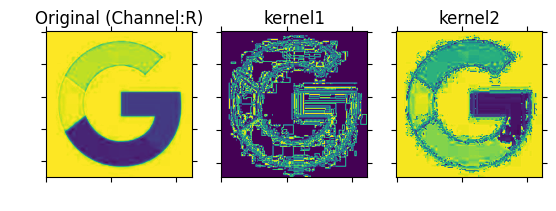
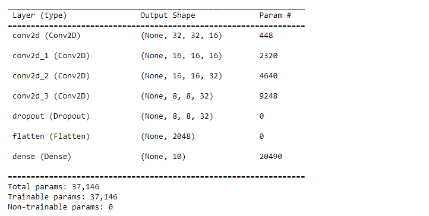
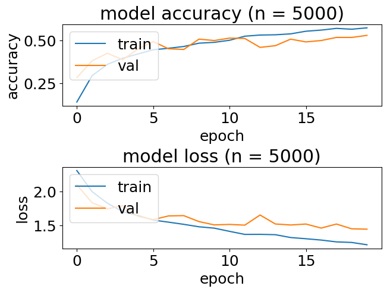
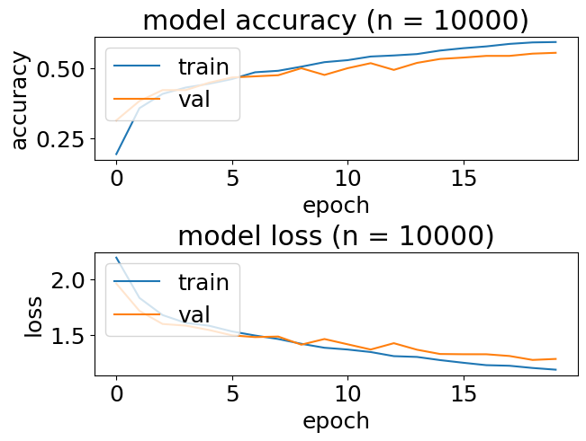
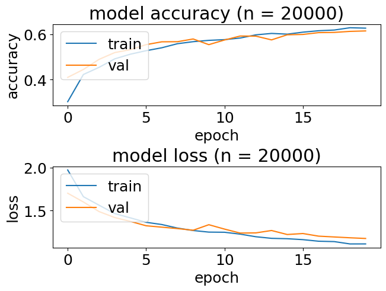
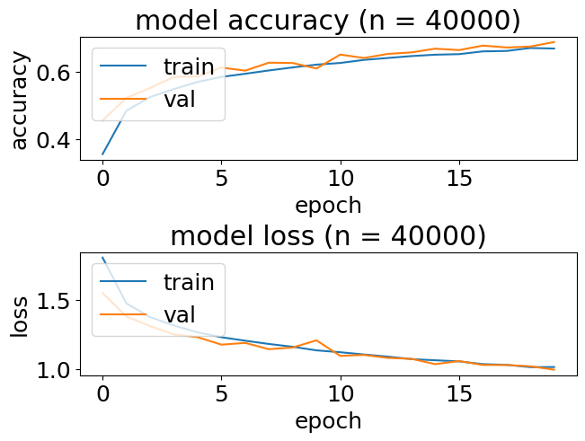
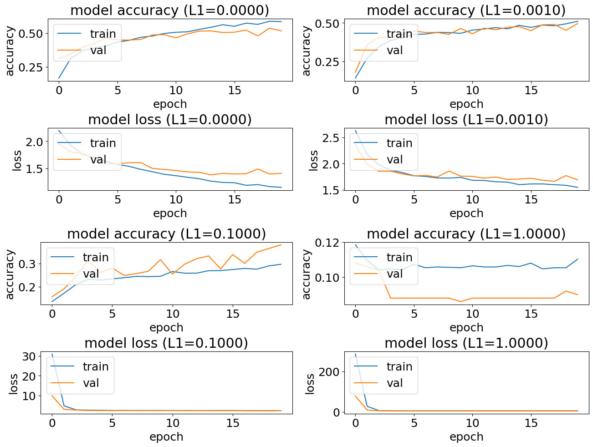
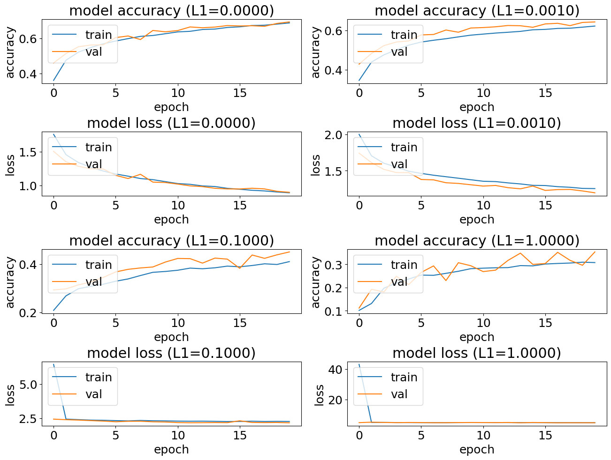
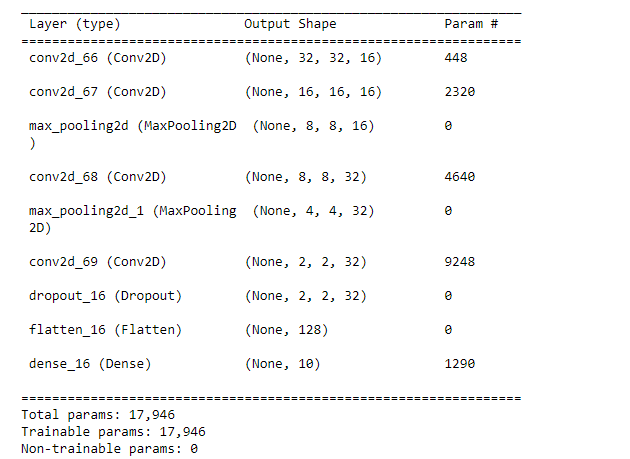
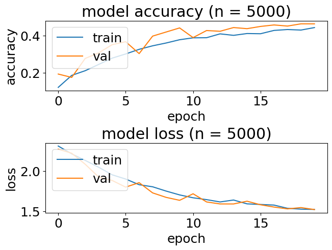

# Week8 Assignment Report

## (i)

(a)&(b) For this question, using an image of the google icon as input image, and the channel used for calculation is the red channel. The following plot shows that the original image (red channel) and the results calculated with the two kernels. 

<div> 
<center>

</center>
</div> 
## (ii)

(a) The model has 5 layers in total. To be more specific, the model contains 4 convolutional layers with 3*3 kernels and a dense layer. The first two convolutional layers set the dimensionality of the output space to 16 while the other two set it to 32. All convolutional layers applied ReLu as the activation function. The dense layer is attached for classification, it has the number of classes as the output shape, and implemented Softmax for probability calculation. 

​	Additionally, we can see that there are two strategies, dropout and flatten applied to the model. The dropout strategy ignores the output of several nodes by a certain rate, to avoid overfitting. The input is a high-dimension tensor before it goes through the flattening module, and the module transfers the tensor into a (1, n) vector. 

(b)

​	(i) The following screenshot shows that apart from the two strategies, dropout and flatten, all the layers have parameters to be trained. The model has 37146 parameters in total, and the dense layer has the most parameters. The dense layer takes the result from Flatten as the input and has 10 output channels. With bias considered, the calculation of the parameter number for this layer shall be (2048+1)*10=20490. The model we trained reached a 63% accuracy on the test set, while the accuracy on the training set is 50%. It is reasonable that the accuracy on the test set is slightly lower than the one on the training set. The gap between the two accuracies is not large, thus we can know that the model is not overfitting. The number of samples falling in each class is average, therefore a baseline model that always predicts the most common label will only obtain an accuracy of around 10%. Our model has a performance far better than the baseline. 

<div> 
<center>

</center>
</div> 
​	(ii) The following plot shows the accuracy and loss of the model:

<div> 
<center>

</center>
</div> 
​	An underfitting model should have low accuracies and high losses on both training and testing sets. Since the model performs much better than the baseline model, we can say that the model isn't underfitting. On the other hand, when overfitting occurs, the accuracy should be high on the training set but low on the test set. This also indicates the model has a high testing loss and a low training loss. So we can know that there's no overfitting as well. 

​	(iii) We've already got the accuracy and loss plot for 5K training data points from last question. Therefore, we only need to obtain other three plots here:

<div> 
<center>

</center>
</div> 

<div> 
<center>

</center>
</div> 

<div> 
<center>

</center>
</div> 

​	For this question, the whole process was finished within 10 minutes. And we can obtain the accuracy of different amount of training data:

|         | training set | test set |
| ------- | ------------ | -------- |
| **5k**  | 63%          | 50%      |
| **10k** | 66%          | 56%      |
| **20k** | 68%          | 61%      |
| **40k** | 73%          | 68%      |

​	And the time to train the network:

- 5K: 40 seconds
- 10k: 76 seconds
- 20k: 147 seconds
- 40k: 290 seconds

​	We can know that a larger time consumption when the size of the dataset was enlarged. The accuracies on both datasets rise when the size of the amount of training data increases, suggesting we can obtain better performances by expanding the training set. Moreover, when the data size becomes bigger, the accuracy gap between the two datasets shrinks. To sum up, training a model with a larger dataset not only enhances its performance but can also suppress the chance of facing both underfitting and overfitting. 

```python
ConvNet(n=5000, L1_range=[0, 0.001, 0.1, 1])
```

​	(iv) The range of L1 is set to [0, 0.001, 0.1, 1] and using 5K training data as above. And we can see the accuracies of four trained models as following plots:

<div> 
<center>

</center>
</div> 

```python
ConvNet(n=40000, L1_range=[0, 0.001, 0.1, 1])
```

Then we can set L1 to [0, 0.001, 0.1, 1] and using 40K training data as above. And we can see the accuracies of four trained models as following plots:

<div> 
<center>

</center>
</div> 

​	According to plots we obtained above, with a greater L1 the performance gap between the two different datasets lessens, indicating a smaller risk of overfitting. However, if the L1 is too large, the model will be underfitting. When we set the L1 to 1 with 5k training data, the prediction accuracy on both datasets dramatically dropped to less than 0.12. Also an ideal regularization strength should be moderate. Although it may be time-consuming, enlarging the dataset is still the better way to avoid overfitting.

(c)

​	(i)&(ii) So our new model with max-pooling will be:

```python
            model = keras.Sequential()
            model.add(Conv2D(16, (3,3), padding='same', input_shape=x_train.shape[1:],activation='relu'))
            model.add(Conv2D(16, (3,3), strides=(2,2), padding='same', activation='relu'))
            model.add(MaxPooling2D((2, 2)))
            model.add(Conv2D(32, (3,3), padding='same', activation='relu'))
            model.add(Conv2D(32, (3,3), strides=(2,2), padding='same', activation='relu'))
            model.add(MaxPooling2D((2, 2)))
            model.add(Dropout(0.5))
            model.add(Flatten())
            model.add(Dense(num_classes, activation='softmax',kernel_regularizer=regularizers.l1(L1)))
```

<div> 
<center>

</center>
</div> 

<div> 
<center>

</center>
</div> 

​	According to the plots we obtained above, after implementing max-pooling the model only remained with 17,946 parameters in total, and the time required for training is 24 seconds which is reduced a lot. The saving of time is led by parameter reduction. However, down-sampling also harms the accuracy of the final model. The accuracy of training data has dropped from 50% to 46% and test data has dropped from 63% to 51%. Although the performance gap between the two datasets is not large and there's no sign of overfitting, but the model accuracy on the training set is less than 0.5, indicating it's not a good fit. 


# Appendix

```python
import numpy as np
from PIL import Image
import matplotlib.pyplot as plt

def convolution(nd_array, kernel):
    # Do without padding
    n = len(nd_array)
    k = len(kernel)
    
    # Calculate the size of the result
    result = []
    result_size = n-k+1
    for i in range(result_size):
        row = []
        for j in range(result_size):
            cropped = nd_array[i:i+k, j:j+k]
            # Do the calculation, sum up all the elements
            row.append((cropped*kernel).sum())
        result.append(row)
    return np.array(result)
    
# Loading the image
im = Image.open("google.png")
rgb = np.array(im.convert("RGB")) 
r=rgb[:,:,0]

# Construct the two kernels
kernel1 = np.array([[-1]*3, [-1, 8, -1], [-1]*3])
kernel2 = np.array([[0, -1, 0], [-1, 8, -1], [0, -1, 0]])

# Calculate and output the results
result1 = convolution(r, kernel1)
result2 = convolution(r, kernel2)
fig = plt.figure()

# The original figure, red channel
ax = fig.add_subplot(1, 3, 1)
ax.imshow(Image.fromarray(np.uint8(r)))
ax.set_title("Original (Channel:R)")
ax.tick_params(labelcolor='none', top='off', bottom='off', left='off', right='off')
# Convolved with kernel1
ax = fig.add_subplot(1, 3, 2)
ax.imshow(Image.fromarray(np.uint8(result1)))
ax.set_title("kernel1")
ax.tick_params(labelcolor='none', top='off', bottom='off', left='off', right='off')
# Convolved with kernel2
ax = fig.add_subplot(1, 3, 3)
ax.imshow(Image.fromarray(np.uint8(result2)))
ax.set_title("kernel2")
ax.tick_params(labelcolor='none', top='off', bottom='off', left='off', right='off')
plt.show()
```

```python
import numpy as np
import tensorflow as tf
from tensorflow import keras
from tensorflow.keras import layers, regularizers
from keras.layers import Dense, Dropout, Activation, Flatten, BatchNormalization
from keras.layers import Conv2D, MaxPooling2D, LeakyReLU
from sklearn.metrics import confusion_matrix, classification_report
from sklearn.utils import shuffle
import matplotlib.pyplot as plt
import sys
import absl.logging

absl.logging.set_verbosity(absl.logging.ERROR)
def ConvNet(n=5000, L1_range=[0.0001], epochs=20):   
    plt.rc('font', size=18)
    plt.rcParams['figure.constrained_layout.use'] = True

    for L1 in L1_range:
        # Model / data parameters
        num_classes = 10
        input_shape = (32, 32, 3)

        # the data, split between train and test sets
        (x_train, y_train), (x_test, y_test) = keras.datasets.cifar10.load_data()
        x_train = x_train[1:n]; y_train=y_train[1:n]
        #x_test=x_test[1:500]; y_test=y_test[1:500]

        # Scale images to the [0, 1] range
        x_train = x_train.astype("float32") / 255
        x_test = x_test.astype("float32") / 255
        print("orig x_train shape:", x_train.shape)

        # convert class vectors to binary class matrices
        y_train = keras.utils.to_categorical(y_train, num_classes)
        y_test = keras.utils.to_categorical(y_test, num_classes)

        use_saved_model = False
        if use_saved_model:
            model = keras.models.load_model("cifar.model")
        else:
#             model = keras.Sequential()
#             model.add(Conv2D(16, (3,3), padding='same', input_shape=x_train.shape[1:],activation='relu'))
#             model.add(Conv2D(16, (3,3), strides=(2,2), padding='same', activation='relu'))
#             model.add(Conv2D(32, (3,3), padding='same', activation='relu'))
#             model.add(Conv2D(32, (3,3), strides=(2,2), padding='same', activation='relu'))
#             model.add(Dropout(0.5))
#             model.add(Flatten())
#             model.add(Dense(num_classes, activation='softmax',kernel_regularizer=regularizers.l1(L1)))
            model = keras.Sequential()
            model.add(Conv2D(16, (3,3), padding='same', input_shape=x_train.shape[1:],activation='relu'))
            model.add(Conv2D(16, (3,3), strides=(2,2), padding='same', activation='relu'))
            model.add(MaxPooling2D((2, 2)))
            model.add(Conv2D(32, (3,3), padding='same', activation='relu'))
            model.add(Conv2D(32, (3,3), strides=(2,2), padding='same', activation='relu'))
            model.add(MaxPooling2D((2, 2)))
            model.add(Dropout(0.5))
            model.add(Flatten())
            model.add(Dense(num_classes, activation='softmax',kernel_regularizer=regularizers.l1(L1)))
            
            model.compile(loss="categorical_crossentropy", optimizer='adam', metrics=["accuracy"])
            model.summary()

            batch_size = 128
            history = model.fit(x_train, y_train, batch_size=batch_size, epochs=epochs, validation_split=0.1)
            model.save("cifar.model")
            plt.subplot(211)
            plt.plot(history.history['accuracy'])
            plt.plot(history.history['val_accuracy'])
            plt.title('model accuracy (n = %d)'%n)
            #plt.title('model accuracy (L1=%.4f)'%L1)
            plt.ylabel('accuracy')
            plt.xlabel('epoch')
            plt.legend(['train', 'val'], loc='upper left')
            plt.subplot(212)
            plt.plot(history.history['loss'])
            plt.plot(history.history['val_loss'])
            plt.title('model loss (n = %d)'%n)
            #plt.title('model loss (L1=%.4f)'%L1)
            plt.ylabel('loss'); plt.xlabel('epoch')
            plt.legend(['train', 'val'], loc='upper left')
            plt.show()

    preds = model.predict(x_train)
    y_pred = np.argmax(preds, axis=1)
    y_train1 = np.argmax(y_train, axis=1)
    print(classification_report(y_train1, y_pred))
    print(confusion_matrix(y_train1,y_pred))

    preds = model.predict(x_test)
    y_pred = np.argmax(preds, axis=1)
    y_test1 = np.argmax(y_test, axis=1)
    print(classification_report(y_test1, y_pred))
    print(confusion_matrix(y_test1,y_pred))
    
ConvNet()
ConvNet(n=10000)
ConvNet(n=20000)
ConvNet(n=40000)
ConvNet(n=5000, L1_range=[0, 0.001, 0.1, 1])
ConvNet(n=40000, L1_range=[0, 0.001, 0.1, 1])
ConvNet(n=5000)
```

